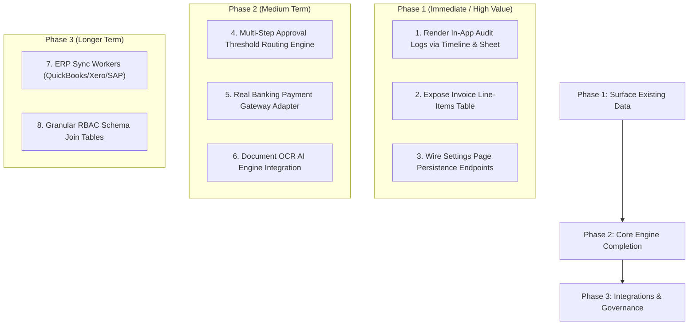

# [Codebase Audit] Future Expansion Capabilities in ClearOps AP Workspace

This audit analyzes the **ClearOps AP Workspace codebase** to identify future expansion capabilities already present, prepared, or architecturally supported. Every finding is strictly grounded in evidence from `apps/api` (Express + TypeScript + Prisma), `apps/web` (React + TypeScript + Vite + Tailwind), and `/docs`.

---

## 1. Classification Overview

| Capability | Readiness Classification | Architectural Foundation in Codebase |
|:---|:---:|:---|
| **Audit Logging & History Trail** | **Ready** | `AuditLog` schema model, `applyTransition` transaction logging, `AuditLog` indexed on `[organizationId, entityType, entityId]`. |
| **Invoice Comments & Discussion** | **Ready** | `Comment` schema model related to `Invoice` & `User` (`invoiceId`, `userId`, `body`, `createdAt`). |
| **In-App Notification Engine** | **Ready** | `Notification` schema model with `status` (`UNREAD`, `READ`, `ARCHIVED`) & `entityType`/`entityId` relation keys. |
| **Filtered Archive Projection** | **Ready** | Route `/archive` querying `invoices` filtering on `status: "ARCHIVED"`. |
| **Design System & UI Primitive Suite** | **Ready** | Token dictionary `tokens.ts`, primitives `<Command>`, `<Sheet>`, `<Timeline>`, `<AISuggestion>`, `<WorkflowStepper>`, `<Dialog>`, `<Tabs>`, `<StatsCard>`, `<Table>`. |
| **Multi-Level Approval Routing** | **Partially Ready** | `Approval` model (`sequenceNumber`, `status` `PENDING|APPROVED|REJECTED|DELEGATED|EXPIRED`, `comment`); `approvals/service.ts` lists pending approvals. |
| **Payment Batching & Execution** | **Partially Ready** | `Payment` model (`AWAITING_SCHEDULE|SCHEDULED|PROCESSING|PAID|FAILED|ON_HOLD`); `payments/service.ts` executes transitions `PAYMENT_RUN` & `PAYMENT_SUCCESS`. |
| **Exception Resolution & Re-Validation** | **Partially Ready** | `Exception` model (14 `ExceptionType` enums, 4 severities); `exceptions/service.ts` handles `assignException` and `resolveException` (`EXCEPTION_RESOLVED`). |
| **3-Way PO Matching Foundation** | **Partially Ready** | `PurchaseOrder` model (`utilizedAmount`, `remainingAmount`, `matchingStatus` `MATCHED|PARTIAL|UNMATCHED`); service lists & creates POs. |
| **AI Extraction & Human Decision Law** | **Partially Ready** | `ai/confidence.test.ts` tests 3 confidence bands (High ≥95%, Medium 80–94%, Low <80%); `<AISuggestion>` UI enforces explicit human click-to-accept. |
| **Multi-Source Ingestion Pipeline** | **Partially Ready** | `InvoiceSource` enum (`EMAIL`, `PORTAL`, `UPLOAD`, `SCANNER`, `MOBILE`, `API`, `EDI`, `ERP`); ingestion currently handles `UPLOAD`. |
| **Workspace Configuration Settings** | **Partially Ready** | `SettingsPage.tsx` with tabs for `User Profile` and `Organization Defaults`; requires API backend persistence binding. |
| **Line-Item Matching Display** | **Possible** | `InvoiceLine` model exists in DB; `table.tsx` exists in UI; requires UI rendering on `InvoiceDetailPage.tsx`. |
| **In-App Audit Trail Drawer/Tab** | **Possible** | `AuditLog` table populated in DB; `<Timeline>` and `<Sheet>` components ready in web UI. |
| **Real OCR / LLM Engine Integration** | **Possible** | Mock OCR text layer exists; ready for Vision OCR / Document AI adapter integration. |
| **ERP Synchronization Adapters** | **Possible** | Workflow state `ERP_SYNC` and event `ERP_SUCCESS` exist; ready for QuickBooks/Xero/SAP connector worker. |
| **Dynamic Granular RBAC Tables** | **Not Supported** | Schema uses fixed `Role` enum (`ADMINISTRATOR`, `FINANCE_MANAGER`, etc.); expanding to dynamic permissions requires join tables. |
| **Multi-Tenant Consolidated Reporting** | **Not Supported** | Schema strictly partitions all tables by `organizationId`; parent-subsidiary cross-tenant analytics requires new schema layer. |

---

## 2. Current Expansion Points

1. **Workflow Engine (`apps/api/src/workflow/`)**:
   - `applyTransition` is the centralized, transaction-safe entry point for state progression across 14 canonical states (`RECEIVED` through `ARCHIVED`). Adding new workflow events or transition rules requires adding entries to `TRANSITIONS` in `transitions.ts`.
2. **Database Layer (`apps/api/prisma/schema.prisma`)**:
   - Schema already contains production-grade models for `AuditLog`, `Comment`, `Notification`, `InvoiceLine`, `Approval`, `Payment`, `Exception`, `PurchaseOrder`, `Supplier`, and `Document`.
3. **UI Primitive Architecture (`apps/web/src/components/ui/`)**:
   - Modular shadcn-based design primitives built on Radix UI and Tailwind CSS with full dark mode support. Ready for any new page or modal layout.
4. **JWT Authentication & Tenant Isolation Middleware (`apps/api/src/middleware/`)**:
   - Every API request derives `organizationId` from authenticated JWT session payload (`req.user.organizationId`), ensuring instant tenant isolation for all future endpoints.

---

## 3. Future Capabilities Already Supported by the Code [READY]

### A. Full Audit Trail & Event Logging
- **Evidence**: `AuditLog` model in `schema.prisma` indexed on `[organizationId, entityType, entityId]`.
- **Implementation**: `apps/api/src/workflow/engine.ts` automatically creates an `AuditLog` record on every workflow state transition storing `beforeData`, `afterData`, `event`, and `triggeredBy`. `service.ts` logs invoice creation.

### B. In-App Commenting System
- **Evidence**: `Comment` model in `schema.prisma` (`id`, `invoiceId`, `userId`, `body`, `createdAt`) with foreign keys to `Invoice` and `User`.
- **Implementation**: Data model fully established for invoice collaborative discussions.

### C. Notification Engine
- **Evidence**: `Notification` model in `schema.prisma` (`userId`, `type`, `title`, `message`, `entityType`, `entityId`, `status` `UNREAD|READ|ARCHIVED`).
- **Implementation**: Ready to send and track in-app user notifications for approval requests, exception assignments, and payment execution.

### D. Filtered Archive Lifecycle Navigation
- **Evidence**: `apps/web/src/pages/archive/ArchivePage.tsx`.
- **Implementation**: Fulfills Doc 18 §18.2 directive by querying `/api/v1/invoices?status=ARCHIVED` to present a clean, dedicated archive workspace.

### E. Comprehensive Token & Component Primitive System
- **Evidence**: `apps/web/src/design-system/tokens.ts` and `apps/web/src/components/ui/`.
- **Implementation**: Contains `<Command>` (global Ctrl+K search), `<Sheet>` (drawer overlay), `<Timeline>` (event feed), `<AISuggestion>` (confidence band selector), `<WorkflowStepper>` (horizontal & vertical state rendering), `<Dialog>`, `<Tabs>`, `<StatsCard>`, and `<Table>`.

---

## 4. Partially Implemented Capabilities [PARTIALLY READY]

### A. Multi-Level Approval Routing
- **Code Evidence**:
  - `schema.prisma`: `model Approval` with `sequenceNumber`, `status` (`PENDING`, `APPROVED`, `REJECTED`, `DELEGATED`, `EXPIRED`), `approverId`, `comment`.
  - `apps/api/src/modules/approvals/service.ts`: `listApprovals` queries pending approvals per approver.
  - `apps/web/src/pages/approvals/ApprovalsPage.tsx`: Lists pending approvals with one-click approve/reject prompts.
- **Missing for Full Readiness**: Multi-tier threshold routing logic (e.g., invoices > $50,000 requiring 2 approvers).

### B. Payment Scheduling & Execution Engine
- **Code Evidence**:
  - `schema.prisma`: `model Payment` supporting `AWAITING_SCHEDULE`, `SCHEDULED`, `PROCESSING`, `PAID`, `FAILED`, `ON_HOLD`.
  - `apps/api/src/modules/payments/service.ts`: `schedulePayment` and `executePayment` run `PAYMENT_RUN` and `PAYMENT_SUCCESS` state transitions via `applyTransition`.
  - `apps/web/src/pages/payments/PaymentsPage.tsx`: Lists payments with `Schedule Payment` and `Execute Payment` actions.
- **Missing for Full Readiness**: Real banking / payment gateway integration (e.g., Stripe, ACH, NACHA API adapters).

### C. Exception Management & Manual Resolution
- **Code Evidence**:
  - `schema.prisma`: `model Exception` with 14 `ExceptionType` enums and 4 `ExceptionSeverity` enums.
  - `apps/api/src/modules/exceptions/service.ts`: `assignException` and `resolveException` update status and trigger `EXCEPTION_RESOLVED` transition back into workflow engine.
  - `apps/web/src/pages/exceptions/ExceptionsPage.tsx`: Lists exceptions sorted by severity and age with resolution modal.
- **Missing for Full Readiness**: Automated rule-specific resolution actions (e.g. auto-linking PO from exception panel).

### D. 3-Way PO Matching Data Structure
- **Code Evidence**:
  - `schema.prisma`: `model PurchaseOrder` with `totalAmount`, `utilizedAmount`, `remainingAmount`, `status` (`OPEN|CLOSED|CANCELLED`), `matchingStatus` (`MATCHED|PARTIAL|UNMATCHED`).
  - `apps/api/src/modules/purchase_orders/service.ts`: `listPurchaseOrders`, `getPurchaseOrder`, `createPurchaseOrder`.
  - `apps/web/src/pages/purchase-orders/PurchaseOrdersPage.tsx`: PO list and create modal.
- **Missing for Full Readiness**: Automated line-by-line 3-way matching algorithm comparing PO line items vs Invoice line items vs Goods Received Notes.

### E. AI Confidence Classification & Non-Automated Transition Law
- **Code Evidence**:
  - `apps/api/src/modules/ai/confidence.test.ts`: Tests `HIGH` (≥95%), `MEDIUM` (80–94%), `LOW` (<80%) confidence bands. Enforces rule that AI score *never* advances state without explicit human click.
  - `apps/web/src/components/ui/AISuggestion.tsx`: Renders visual confidence pills with human `Accept` and `Override` click buttons.
- **Missing for Full Readiness**: Production OCR model / LLM Document API connection.

---

## 5. Natural Next Extensions [POSSIBLE]

1. **Invoice Line-Item Display & Editing**:
   - *Foundation*: `InvoiceLine` model exists in `schema.prisma`; `<Table>` primitive exists in `apps/web`.
   - *Extension*: Render an interactive line-items table on `InvoiceDetailPage.tsx`.
2. **Audit Trail Side-Drawer / History Tab**:
   - *Foundation*: `AuditLog` records are written automatically on every workflow state transition; `<Sheet>` and `<Timeline>` components exist in `apps/web`.
   - *Extension*: Add an "Audit History" button/tab on `InvoiceDetailPage.tsx` opening `<Sheet>` with `<Timeline>` rendering `AuditLog` entries.
3. **Real OCR Engine Integration**:
   - *Foundation*: `Document` model has `ocrStatus` and `extractionStatus`; `InvoiceSource` enum includes `EMAIL`, `PORTAL`, `UPLOAD`, `API`.
   - *Extension*: Replace mock OCR delay in `createInvoice` with an asynchronous worker calling AWS Textract / Azure Form Recognizer / Google Document AI.
4. **ERP Sync Connector Adapters**:
   - *Foundation*: Workflow state `ERP_SYNC` and event `ERP_SUCCESS` are defined in `states.ts` and `transitions.ts`.
   - *Extension*: Implement sync workers pushing paid invoices to QuickBooks Online / Xero / SAP REST APIs.

---

## 6. Architectural Constraints [NOT SUPPORTED WITHOUT ARCHITECTURAL CHANGES]

1. **Dynamic Granular RBAC (Role-Based Access Control)**:
   - *Current State*: Fixed `Role` enum on `User` (`ADMINISTRATOR`, `FINANCE_MANAGER`, `FINANCE_EXECUTIVE`, `APPROVER`, `READ_ONLY`).
   - *Constraint*: Schema header explicitly notes that separate `Role`, `Permission`, and `UserRole` join tables must be created to support custom enterprise permission matrices.
2. **Multi-Tenant Consolidated Reporting / Parent-Child Orgs**:
   - *Current State*: Schema strictly isolates all entities by single `organizationId`.
   - *Constraint*: Cross-tenant organizational hierarchies (e.g. holding company viewing 5 subsidiary workspaces) require an explicit multi-tenant hierarchy mapping table and aggregate query layer.
3. **Real-Time Push Notifications / WebSockets**:
   - *Current State*: Standard HTTP REST architecture with `express` and Vite.
   - *Constraint*: Real-time multi-user live presence or push notifications require adding WebSocket (Socket.io / ws) or Server-Sent Events (SSE) server infrastructure.

---

## 7. Technical Debt That May Block Future Expansion

1. **Synchronous In-Memory Workflow Transitions**:
   - `processInvoice` and `executePayment` currently run transitions synchronously within HTTP request cycles. As background tasks grow (e.g. OCR processing, banking webhooks), a job queue (e.g. BullMQ with Redis) will be required.
2. **Denormalized `invoices.status` Maintenance Rule**:
   - `invoices.status` is a read-only projection maintained strictly by `applyTransition` in `apps/api/src/workflow/engine.ts`. Future developers must strictly avoid writing `invoices.status` directly in services or controllers (AGENTS.md Rule 4).
3. **Settings Page Form State Persistence**:
   - `SettingsPage.tsx` manages local React state for profile and organization defaults, but does not currently make PUT/POST API calls to persist changes back to `Organization` or `User` database tables.

---

## 8. Recommended Expansion Sequence

---

## 9. Affected Files & Component Registry

| Component / Feature Area | Primary Backend Files | Primary Frontend Files | Database Models Involved |
|:---|:---|:---|:---|
| **Workflow Engine & Lifecycle** | [apps/api/src/workflow/engine.ts](file:///d:/Antigravity/ap-saas/apps/api/src/workflow/engine.ts) [apps/api/src/workflow/transitions.ts](file:///d:/Antigravity/ap-saas/apps/api/src/workflow/transitions.ts) | [apps/web/src/components/ui/WorkflowStepper.tsx](file:///d:/Antigravity/ap-saas/apps/web/src/components/ui/WorkflowStepper.tsx) | `WorkflowInstance` `WorkflowTransition` |
| **Audit Log Trail** | [apps/api/src/workflow/engine.ts](file:///d:/Antigravity/ap-saas/apps/api/src/workflow/engine.ts) | [apps/web/src/components/ui/Timeline.tsx](file:///d:/Antigravity/ap-saas/apps/web/src/components/ui/Timeline.tsx) [apps/web/src/components/ui/Sheet.tsx](file:///d:/Antigravity/ap-saas/apps/web/src/components/ui/Sheet.tsx) | `AuditLog` |
| **Approvals Routing** | [apps/api/src/modules/approvals/service.ts](file:///d:/Antigravity/ap-saas/apps/api/src/modules/approvals/service.ts) | [apps/web/src/pages/approvals/ApprovalsPage.tsx](file:///d:/Antigravity/ap-saas/apps/web/src/pages/approvals/ApprovalsPage.tsx) | `Approval` |
| **Payments Execution** | [apps/api/src/modules/payments/service.ts](file:///d:/Antigravity/ap-saas/apps/api/src/modules/payments/service.ts) | [apps/web/src/pages/payments/PaymentsPage.tsx](file:///d:/Antigravity/ap-saas/apps/web/src/pages/payments/PaymentsPage.tsx) | `Payment` |
| **Exception Resolution** | [apps/api/src/modules/exceptions/service.ts](file:///d:/Antigravity/ap-saas/apps/api/src/modules/exceptions/service.ts) | [apps/web/src/pages/exceptions/ExceptionsPage.tsx](file:///d:/Antigravity/ap-saas/apps/web/src/pages/exceptions/ExceptionsPage.tsx) | `Exception` |
| **3-Way PO Matching** | [apps/api/src/modules/purchase_orders/service.ts](file:///d:/Antigravity/ap-saas/apps/api/src/modules/purchase_orders/service.ts) | [apps/web/src/pages/purchase-orders/PurchaseOrdersPage.tsx](file:///d:/Antigravity/ap-saas/apps/web/src/pages/purchase-orders/PurchaseOrdersPage.tsx) | `PurchaseOrder` `InvoiceLine` |
| **AI Extraction Intelligence** | [apps/api/src/modules/ai/confidence.test.ts](file:///d:/Antigravity/ap-saas/apps/api/src/modules/ai/confidence.test.ts) | [apps/web/src/components/ui/AISuggestion.tsx](file:///d:/Antigravity/ap-saas/apps/web/src/components/ui/AISuggestion.tsx) | `Document` |
| **Settings & Workspace Config** | [apps/api/src/modules/users/service.ts](file:///d:/Antigravity/ap-saas/apps/api/src/modules/users/service.ts) | [apps/web/src/pages/settings/SettingsPage.tsx](file:///d:/Antigravity/ap-saas/apps/web/src/pages/settings/SettingsPage.tsx) | `Organization` `User` |
